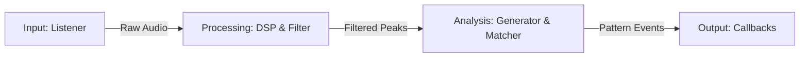

# Acoustic Alarm Engine Architecture

The Acoustic Alarm Engine is a standalone library designed to detect repetitive acoustic patterns (such as smoke alarms, CO detectors, and appliance beeps) in real-time.

It utilizes a robust **windowed analysis** approach, making it highly resilient to background noise, missing events, and temporary audio dropouts.

## 🏗 High-Level Architecture

The system operates as a 4-stage processing pipeline:



These stages map directly to the package directory structure:

- **Input (`input/`)**: Hardware interface and audio capture.
- **Processing (`processing/`)**: Signal processing and frequency filtering.
- **Analysis (`analysis/`)**: Event abstraction and pattern matching logic.

---

## 📂 Directory Layout

The codebase is organized into functional modules:

```text
src/acoustic_engine/
├── engine.py                 # Main orchestrator (Facade)
├── config.py                 # Configuration and factory methods
├── models.py                 # Core data structures (AlarmProfile, Segment)
├── events.py                 # Event definitions (ToneEvent, PatternMatchEvent)
│
├── input/
│   └── listener.py           # Audio capture (PyAudio) implementation
│
├── processing/
│   ├── dsp.py                # FFT and SpectralMonitor logic
│   └── filter.py             # FrequencyFilter (The "Screener")
│
└── analysis/
    ├── generator.py          # EventGenerator (Peaks -> Tones)
    ├── event_buffer.py       # Circular buffer for event history
    ├── windowed_matcher.py   # Windowed detection algorithm
    └── matcher.py            # (Legacy) State machine matcher
```

---

## ⚙️ Detailed Pipeline Stages

### 1. Input Stage (`input/listener.py`)

- **Role**: Handles the interface with audio hardware.
- **Component**: `AudioListener`
- **Implementation**:
  - Runs in a **separate thread** to prevent audio dropouts during heavy processing.
  - Uses `PyAudio` (PortAudio wrapper) to capture 16-bit mono PCM audio.
  - Buffers incoming audio into fixed chunks (default: 4096 samples).
  - Invokes a callback for every captured chunk.

### 2. Processing Stage (`processing/`)

This stage transforms time-domain audio into frequency domain data and filters out noise.

#### A. Digital Signal Processing (`processing/dsp.py`)

- **Component**: `SpectralMonitor`
- **Function**:
  - Applies a Hanning window to the audio chunk.
  - Performs a Real Fast Fourier Transform (rFFT).
  - Detects **spectral peaks** based on magnitude and "sharpness" (prominence against neighbors).
  - Returns a list of `Peak` objects (Frequency, Magnitude).

#### B. Frequency Filtering (`processing/filter.py`)

- **Component**: `FrequencyFilter`
- **Role**: The "Screener".
- **Function**:
  - Pre-analyzes all loaded `AlarmProfile`s to find all relevant frequency ranges.
  - **Discards any peak** that acts outside these known ranges.
  - **Benefit**: This makes the engine "deaf" to speech, music, and background noise, significantly reducing downstream CPU usage.

### 3. Analysis Stage (`analysis/`)

This stage converts continuous data into discrete events and looks for patterns.

#### A. Event Generation (`analysis/generator.py`)

- **Component**: `EventGenerator`
- **Function**:
  - Tracks persistence of spectral peaks across multiple chunks.
  - Handles **debouncing**: Short noises (< min_duration) are ignored.
  - Handles **dropouts**: Short gaps (< tolerance) in a tone are bridged, treating it as one continuous tone.
  - Emits `ToneEvent` objects only when a tone has finished and is "safe" to release (chronological ordering guaranteed).

#### B. Windowed Matching (`analysis/windowed_matcher.py`)

- **Component**: `WindowedMatcher`
- **Function**: Replaces traditional state machines with sliding window analysis.
  1.  **Buffer**: Stores all `ToneEvent`s in a circular buffer (e.g., last 30-60s).
  2.  **Slide**: Periodically (every ~0.5s) looks back at the recent history.
  3.  **Evaluate**:
      - Extracts events relevant to a specific profile.
      - Tries to find the "best fit" pattern starting from every potential event in the window.
      - Ignores leading/trailing noise.
  4.  **Confirm**: If the "best fit" sequence has enough cycles (e.g., 3 beeps + 3 pauses), it triggers a match.

---

## 💾 Core Data Models (`models.py` & `events.py`)

### Events (`events.py`)

Events represent points in time where something significant happened.

- **`ToneEvent`**:

  - `timestamp` (float): Start time in seconds.
  - `duration` (float): Duration in seconds.
  - `frequency` (float): The dominant frequency Hz.
  - `confidence` (float): Signal strength indicator.

- **`PatternMatchEvent`**:
  - `profile_name` (str): Which alarm was detected.
  - `timestamp` (float): Time of detection.
  - `cycle_count` (int): How many pattern cycles were verified.

### Profiles (`models.py`)

Profiles define what the engine is looking for. They are typically loaded from YAML.

- **`AlarmProfile`**:

  - `name`: Unique ID (e.g., "smoke_alarm_t3").
  - `segments`: A list of `Segment`s defining one cycle (e.g., Tone -> Silence -> Tone).
  - `confirmation_cycles`: How many repetitions are needed (default 2 or 3).
  - `window_duration`: (Auto-calculated) How far back to look in time.

- **`Segment`**:
  - `type`: "tone" or "silence".
  - `frequency`: `Range(min, max)` in Hz.
  - `duration`: `Range(min, max)` in seconds.

---

## 🧵 Threading Model

1.  **Audio Thread**: `AudioListener` runs in its own thread, exclusively reading from the microphone and pushing chunks to a queue or callback. This ensures no audio data is lost.
2.  **Processing Thread**: (Usually the Main Thread or a worker).
    - `Engine.process_chunk()` is called for each chunk.
    - It runs filter -> generator -> matcher sequentially.
    - This is fast enough to run in real-time on standard hardware (Raspberry Pi 3+).
3.  **Callback Execution**: Callbacks (`on_match`) are executed synchronously within the processing loop. For heavy operations, users should offload callback logic to a separate thread.

---

## 🔌 Integration Points

The `Engine` class (`engine.py`) acts as the primary facade.

```python
from acoustic_engine import Engine, GlobalConfig

# 1. Load configuration
config = GlobalConfig.load("config.yaml")

# 2. Initialize Engine
engine = Engine.from_config(config)

# 3. Start (Blocking or Async)
engine.start()
```
