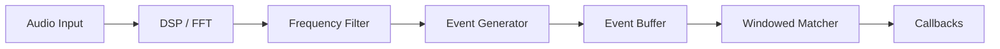
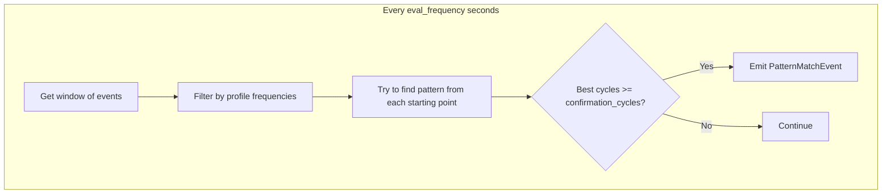

# Acoustic Alarm Engine Architecture

This document details the architecture, detection pipeline, and key algorithms of the Acoustic Alarm Engine.

## 🏗 System Architecture

The engine transforms raw audio samples into high-level alarm events through a multi-stage pipeline:



---

## Pipeline Components

### 1. Audio Input (Listener)

- Captures raw audio via ALSA/PulseAudio (Linux) or PyAudio
- **Sample Rate:** Default 44100Hz (configurable)
- **Chunk Size:** Default 4096 samples (~93ms at 44.1kHz)

### 2. DSP & Spectral Analysis

- Converts time-domain audio to frequency-domain using **FFT**
- **Peak Detection:** Identifies dominant frequencies in each chunk
- **Noise Floor Estimation:** Dynamic percentile-based noise profiling

### 3. Frequency Filter

- **Pre-filtering:** Discards spectral peaks not matching any loaded alarm profile
- Drastically reduces downstream processing by ignoring irrelevant sounds (music, speech, etc.)

### 4. Event Generator

Converts continuous spectral peaks into discrete `ToneEvent` objects:

- **Tone Tracking:** Tracks active frequencies across multiple chunks
- **Debouncing:** Ignores momentary dropouts (<150ms) for solid tone detection
- **Safe Release:** Buffers events to enforce chronological ordering

### 5. Event Buffer

Circular buffer storing recent events for windowed analysis:

- **Time-based Pruning:** Automatically removes events older than `max_duration` (default 60s)
- **Window Queries:** Efficiently retrieves events within a time range

### 6. Windowed Matcher

**Core innovation for noise resilience.** Instead of sequential state-machine matching, uses sliding window analysis:



**Key benefits:**

- **Noise before pattern:** Background beeps before the actual alarm don't break detection
- **Noise after pattern:** Trailing noise is ignored
- **Multiple evaluation:** Each pattern is evaluated multiple times as the window slides

---

## 🧠 Key Algorithms

### Windowed Pattern Matching

1. For each profile, calculate `window_duration` (default: 1.5× pattern length × cycles)
2. Every `eval_frequency` seconds (default: 0.5s), evaluate the window
3. Filter events to those matching profile's frequency ranges
4. Try to match the pattern starting from each event
5. If `best_cycles >= confirmation_cycles`, emit a match

### Auto-Configuration

Window parameters are auto-calculated if not specified:

```python
pattern_duration = sum(segment.duration.mean for segment in profile.segments)
window_duration = pattern_duration * confirmation_cycles * 1.5
eval_frequency = min(0.5, pattern_duration / 4)
```

### Resolution vs. Stability Trade-off

| FFT Size     | Chunk Duration | Best For                                       |
| ------------ | -------------- | ---------------------------------------------- |
| 4096 samples | ~93ms          | Standard alarms (T3 smoke), noisy environments |
| 2048 samples | ~46ms          | Faster patterns                                |
| 1024 samples | ~23ms          | T4 CO alarms, rapid beeps                      |

---

## ✅ Capabilities

| Category               | Examples                                      | Status       |
| ---------------------- | --------------------------------------------- | ------------ |
| **Safety Alarms**      | Smoke (T3), CO (T4), evacuation sirens        | ✅ Excellent |
| **Appliance Beeps**    | Microwave, washer, dryer, dishwasher          | ✅ Good      |
| **Tonal Alerts**       | Specific frequency tones (e.g., 3kHz ± 100Hz) | ✅ Good      |
| **Noisy Environments** | TV, conversation, traffic background          | ✅ Robust    |

## ❌ Limitations

| Type                    | Examples                         | Reason                           |
| ----------------------- | -------------------------------- | -------------------------------- |
| **Non-tonal sounds**    | Voice alerts, clicks, percussion | Engine detects pure tones only   |
| **Polyphonic melodies** | Complex overlapping music        | Designed for sequential patterns |
| **Sub-bass (<200Hz)**   | Very low rumbles                 | FFT resolution limits            |

---

## 🛠 Configuration

### Profile Parameters

```yaml
name: "AlarmName"
segments: [...] # Tone/silence sequence
confirmation_cycles: 2 # Cycles required before detection
reset_timeout: 10.0 # Seconds before resetting (legacy)
window_duration: null # Auto-calculated if null
eval_frequency: 0.5 # Seconds between evaluations
```

### Generator Parameters (in code)

| Parameter             | Default | Description                                 |
| --------------------- | ------- | ------------------------------------------- |
| `min_tone_duration`   | 0.1s    | Minimum duration to count as valid tone     |
| `dropout_tolerance`   | 0.15s   | Maximum gap before tone is considered ended |
| `frequency_tolerance` | 50Hz    | Frequency matching tolerance                |

### Tuning Tips

1. **Use the Tuner:** Always record and visualize the alarm first
2. **Wide Frequency Tolerance:** Alarms drift. If tuner shows 3200Hz, use 3100-3300Hz
3. **Generous Duration:** Sound reflects. A 0.5s beep often measures as 0.6s
4. **Start with 2 cycles:** Use `confirmation_cycles: 2` to reduce false positives
