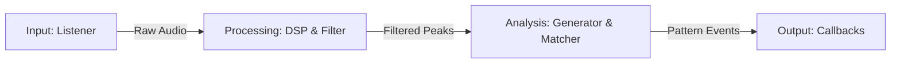

# Acoustic Engine Architecture

The Acoustic Engine is a standalone library designed to detect repetitive acoustic patterns (such as smoke alarms, CO detectors, and appliance beeps) in real-time.

It utilizes a robust **windowed analysis** approach, making it highly resilient to background noise, missing events, and temporary audio dropouts.

## High-Level Architecture

The system operates as a 4-stage processing pipeline:


```mermaid
graph LR
    A[Input: Listener] -->|Raw Audio| B[Processing: DSP & Filter]
    B -->|Filtered Peaks| C[Analysis: Generator & Matcher]
    C -->|Pattern Events| D[Output: Callbacks]
```

These stages map directly to the package directory structure:

- **Input (`input/`)**: Hardware interface and audio capture.
- **Processing (`processing/`)**: Signal processing and frequency filtering.
- **Analysis (`analysis/`)**: Event abstraction and pattern matching logic.

---

## Directory Layout

```text
src/acoustic_engine/
├── engine.py                 # Main orchestrator (Facade)
├── parallel_engine.py        # Multi-profile parallel runner
├── runner.py                 # Production CLI entry point
├── config.py                 # Configuration, presets, GlobalConfig loader
├── models.py                 # Core data structures (AlarmProfile, Segment, Range)
├── events.py                 # Event definitions (ToneEvent, PatternMatchEvent)
├── profiles.py               # YAML profile loading and serialization
│
├── input/
│   └── listener.py           # Audio capture (PyAudio) implementation
│
├── processing/
│   ├── dsp.py                # FFT, SpectralMonitor, adaptive noise floor
│   └── filter.py             # FrequencyFilter (early relevance screening)
│
├── analysis/
│   ├── generator.py          # EventGenerator (Peaks -> Tones, debouncing, dip detection)
│   ├── event_buffer.py       # Circular buffer for event history
│   └── windowed_matcher.py   # Windowed pattern matching algorithm
│
├── tester/
│   ├── __init__.py            # CLI for testing profiles against audio/mic
│   ├── runner.py              # TestRunner (full pipeline orchestration)
│   ├── display.py             # Terminal output formatting
│   └── mixer.py               # Noise injection (white/pink/brown)
│
└── tuner/
    ├── __init__.py            # NiceGUI Python tuner entry point
    ├── gui.py                 # NiceGUI web interface
    ├── logic.py               # Audio analysis logic for the Python tuner
    └── validate.py            # FastAPI validation API (real engine pipeline)

tuner/                         # React browser app (standalone)
├── src/
│   ├── AcousticTuner.jsx      # Main UI component
│   └── audio.js               # FFT analysis, adaptive threshold, cycle detection
├── package.json
└── vite.config.js

profiles/                      # Alarm profile YAML files
├── smoke_alarm.yaml
├── co_sensor.yaml
└── ...
```

---

## Detailed Pipeline Stages

### 1. Input Stage (`input/listener.py`)

- **Role**: Handles the interface with audio hardware.
- **Component**: `AudioListener`
- **Implementation**:
  - Runs in a **separate thread** to prevent audio dropouts during heavy processing.
  - Uses `PyAudio` (PortAudio wrapper) to capture 16-bit mono PCM audio.
  - Buffers incoming audio into fixed chunks (default: 1024 samples).
  - Invokes a callback for every captured chunk.

### 2. Processing Stage (`processing/`)

Transforms time-domain audio into frequency domain data and filters out noise.

#### A. Digital Signal Processing (`processing/dsp.py`)

- **Component**: `SpectralMonitor`
- **Function**:
  - Applies a Hanning window to the audio chunk.
  - Performs a Real Fast Fourier Transform (rFFT).
  - Detects **spectral peaks** based on magnitude and "sharpness" (prominence against neighbors).
  - Uses **parabolic interpolation** for sub-bin frequency accuracy.
  - Maintains an **adaptive noise floor** using asymmetric EMA (fast adaptation to quiet, slow adaptation to noise).
  - Returns a list of `Peak` objects (Frequency, Magnitude, Bin Index).

#### B. Frequency Filtering (`processing/filter.py`)

- **Component**: `FrequencyFilter`
- **Role**: The "Screener".
- **Function**:
  - Pre-analyzes all loaded `AlarmProfile`s to find all relevant frequency ranges.
  - **Discards any peak** that falls outside these known ranges.
  - Merges overlapping ranges for efficiency.
  - Makes the engine "deaf" to speech, music, and background noise.

### 3. Analysis Stage (`analysis/`)

Converts continuous data into discrete events and looks for patterns.

#### A. Event Generation (`analysis/generator.py`)

- **Component**: `EventGenerator`
- **Function**:
  - Tracks persistence of spectral peaks across multiple chunks.
  - **Debouncing**: Short noises (< min_duration) are ignored.
  - **Dropout tolerance**: Short gaps in a tone are bridged, treating it as one continuous tone.
  - **Dip detection**: Detects reverb tails (>40% magnitude drop) to avoid stretching tone duration.
  - **Frequency smoothing**: EMA-based tracking across chunks.
  - **Chronological output**: Events are buffered and released in strict time order.
  - Emits `ToneEvent` objects only when a tone has finished.

#### B. Windowed Matching (`analysis/windowed_matcher.py`)

- **Component**: `WindowedMatcher`
- **Function**: Replaces traditional state machines with sliding window analysis.
  1. **Buffer**: Stores all `ToneEvent`s in a circular buffer (up to 60s).
  2. **Slide**: Periodically (every ~0.5s) looks back at recent history.
  3. **Evaluate**: Extracts events relevant to a specific profile, tries to find the "best fit" pattern starting from every potential event in the window. Ignores leading/trailing noise.
  4. **Confirm**: If enough cycles are matched (per `confirmation_cycles`), triggers a `PatternMatchEvent`.

---

## Core Data Models

### Events (`events.py`)

- **`ToneEvent`**: `timestamp`, `duration`, `frequency`, `magnitude`, `confidence`
- **`PatternMatchEvent`**: `timestamp`, `duration`, `profile_name`, `cycle_count`

### Profiles (`models.py`)

- **`AlarmProfile`**: `name`, `segments`, `confirmation_cycles`, `reset_timeout`, `resolution`, `window_duration`, `eval_frequency`
- **`Segment`**: `type` (tone/silence/any), `frequency` (Range), `duration` (Range), `min_magnitude`
- **`ResolutionConfig`**: `min_tone_duration`, `dropout_tolerance` (per-profile override)

---

## Threading Model

1. **Audio Thread**: `AudioListener` runs in its own thread, reading from the microphone and pushing chunks via callback. No audio data is lost.
2. **Processing Thread**: `Engine.process_chunk()` runs filter, generator, and matcher sequentially. Fast enough for real-time on Raspberry Pi 3+.
3. **Callback Execution**: Callbacks (`on_match`) are executed synchronously within the processing loop. For heavy operations, offload to a separate thread.

---

## Tooling

### Tester (`tester/`)

Interactive CLI for testing profiles against audio files or live microphone input. Includes noise injection for robustness testing.

```bash
python -m acoustic_engine.tester --profile profiles/smoke_alarm.yaml --audio recording.wav -v
```

### Profile Tuner (`tuner/`)

Two implementations:

- **React browser app** (`tuner/`): Standalone Vite+React app for visual profile building with FFT analysis, adaptive thresholds, spectral gating, and auto cycle detection.
- **Validation API** (`tuner/validate.py`): FastAPI endpoint that runs the real engine pipeline, used by the browser app for ground-truth verification.

```bash
# Browser tuner
cd tuner && npm run dev

# Validation API
python -m acoustic_engine.tuner.validate --port 8787
```

---

## Integration Points

The `Engine` class (`engine.py`) acts as the primary facade.

```python
from acoustic_engine import Engine
from acoustic_engine.config import GlobalConfig

config = GlobalConfig.load("config.yaml")
engine = Engine.from_config(config)
engine.start()
```

For manual chunk processing (custom audio sources):

```python
engine = Engine(profiles=profiles)
for chunk in audio_chunks:
    engine.process_chunk(chunk)
```
