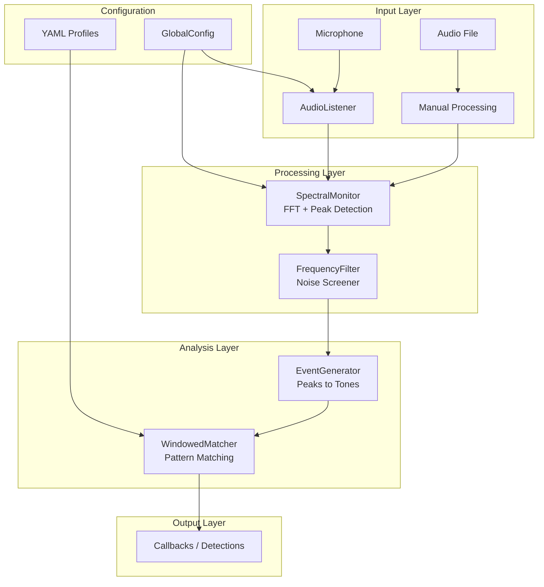

# Acoustic Engine

## Lightweight, Deterministic Sound Recognition for IoT

[](https://www.python.org/downloads/)
[](https://creativecommons.org/licenses/by-nc/4.0/)
[](#)

A high-performance, noise-resilient DSP library designed to detect specific acoustic patterns (Smoke Alarms, CO Detectors, Appliance Beeps) on lightweight hardware.

> [!TIP]
> **Why this engine?** Unlike heavy Neural Networks, the Acoustic Engine uses deterministic Digital Signal Processing (DSP) to achieve high accuracy with low CPU usage. Best for battery-powered or resource-constrained IoT devices.

> [!NOTE]
> **New here? → [Getting Started](docs/getting-started.md)** takes you from install
> to a working detector in about ten minutes, no signal-processing knowledge needed.

## Features

- **Installs clean on a laptop**: `pip install acoustic-engine` and go — PortAudio is bundled in the macOS/Windows wheels (Linux: one `apt` line). No compilers, no heavy ML stack.
- **Zero-config presets**: ship-ready profiles for standardized smoke (T3) and CO (T4) alarms — `acoustic-engine run --preset smoke_t3`.
- **Learn by listening**: `acoustic-engine learn --record` hears *your* alarm from the mic and writes a working profile — or point it at a WAV (`learn alarm.wav`). No DSP knowledge required.
- **One CLI**: `run`, `learn`, `test`, `profiles`, `serve`, plus `devices`/`doctor` to confirm your mic works in seconds — [reference](docs/cli.md).
- **Act on detections**: publish MQTT, POST a webhook, or run any shell command (`--on-detect`) — turn a laptop into an alarm-watching agent.
- **Noise Resilient**: event analysis that ignores background interference (down to ~-15 dB SNR).
- **Efficient**: real-time FFT with low CPU usage — runs comfortably on a Raspberry Pi.
- **Easy config**: simple YAML profiles, validated on load with clear error messages.

---

## Quick Start

### Installation

```bash
pip install acoustic-engine

# …or the very latest from git
pip install "git+https://github.com/h0tp-ftw/acoustic-engine.git"
```

Audio capture uses **sounddevice**, whose macOS and Windows wheels bundle
PortAudio — so on a laptop there is **nothing else to install**. On Linux, add
the small PortAudio runtime once:

```bash
sudo apt install libportaudio2     # Debian / Ubuntu / Raspberry Pi OS
```

For development, clone with the optional extras (`mqtt` = publish detections,
`tuner` = browser app API, `dev` = tests):

```bash
git clone https://github.com/h0tp-ftw/acoustic-engine.git
cd acoustic-engine
pip install -e ".[mqtt,tuner,dev]"
```

### Quick Start (CLI)

Everything is behind one `acoustic-engine` command. The common cases need **no
DSP knowledge and no config file**:

```bash
# 0. Is my mic working? (lists inputs, then a 5s live level meter)
acoustic-engine devices
acoustic-engine doctor

# 1. What can I detect out of the box?
acoustic-engine profiles

# 2. Listen for a standard smoke alarm (ISO 8201 T3) — zero config
acoustic-engine run --preset smoke_t3

# 3. Teach it YOUR alarm — record it live and turn it into a profile
acoustic-engine learn --record --name "My Dryer"          # mic -> my_dryer.yaml (+ .wav)
acoustic-engine test --profile my_dryer.yaml --audio my_dryer.wav -v   # verify it
acoustic-engine run --profile my_dryer.yaml               # deploy it
#    (already have a clip? use it instead:  acoustic-engine learn my_alarm.wav)

# 4. Make it an agent — do something when it fires (no broker needed)
acoustic-engine run --preset smoke_t3 --on-detect 'notify-send "Alarm: {name}"'
acoustic-engine run --preset smoke_t3 --webhook https://ntfy.sh/my-alarms

# 5. Production: run from a config file (multiple alarms, MQTT, tuning)
acoustic-engine run --config config.example.yaml
```

> The three tiers: **presets** (zero config) → **`learn` + hand-edit the YAML
> shape** (frequencies/durations, no DSP) → **advanced engine tuning** (you
> rarely need this). You only go as deep as your sound requires.

### Docker

The mic is shared into the container via `/dev/snd`. See [deploy/README.md](deploy/README.md)
for systemd and Docker details.

```bash
docker compose up engine          # run detection
docker compose run --rm engine acoustic-engine run --preset smoke_t3
```

---

## Documentation

| Guide | What's in it |
| :-- | :-- |
| **[Getting Started](docs/getting-started.md)** | Install → detect → learn your own alarm → deploy. Start here. |
| [Recording Guide](docs/recording.md) | Record an alarm into a profile: `learn --record`, capture technique, verify & tweak. |
| [CLI Reference](docs/cli.md) | Every command and option. |
| [Profiles & Troubleshooting](docs/profiles.md) | How profiles work, and fixes for "won't detect" / "false alarms". |
| [Deployment](deploy/README.md) | systemd, Docker, hardware tips. |
| [Tuning Guide](docs/tuning_guide.md) | The advanced engine knobs (rarely needed). |
| [Architecture](ARCHITECTURE.md) | How the pipeline works inside. |
| [Changelog](CHANGELOG.md) | What's new in each release. |

---

## Profile Tuner (Browser App)

The project includes a React-based browser tool for building alarm YAML configs from audio recordings.

```bash
cd tuner
npm install
npm run dev
# Open http://localhost:5173
```

**Features:**
- FFT-based frequency estimation with parabolic interpolation (~10Hz accuracy)
- Adaptive threshold (noise-floor relative) with spectral gating
- Auto cycle detection — finds repeating patterns without manual input
- YAML import/export matching the engine's profile schema
- Crop, playback, spectrogram visualization

### Validate Against the Real Engine

The tuner includes a validation API that runs your audio + profile through the **actual** detection pipeline (SpectralMonitor, FrequencyFilter, EventGenerator, WindowedMatcher) so you know with certainty whether the engine will detect your alarm.

```bash
# Terminal 1: Start the validation API
acoustic-engine serve --port 8787

# Terminal 2: Start the tuner
cd tuner && npm run dev
```

Click **"Validate with Real Engine"** in the browser. Engine tone events appear as a cyan overlay on the timeline alongside the browser's own analysis, so you can compare both.

---

## Use Cases

- **Life Safety**: Industry-standard Smoke (T3) and CO (T4) alarm detection.
- **Appliances**: Detect microwave beeps, oven timers, or dishwasher completion chimes.
- **Medical**: Monitor critical patient equipment alarms in noisy hospitals.
- **Industrial**: Identify specific machinery fault codes or safety buzzers in high-reverb warehouses.
- **Smart Home**: Trigger automation when your doorbell or dryer buzzes.

### Not Suited For

- **Single / Lone Beeps**: A single beep is too generic. The engine relies on repetition (rhythm) for specificity.
- **Complex Non-Tonal Sounds**: Dog barks, glass breaking, or speech. Use a Neural Network for these.
- **Variable Melodies**: Tunes that change notes every time.

---

## Alarm Profiles

Define patterns in YAML. One sound = one profile.

```yaml
name: "SmokeAlarm_T3"
confirmation_cycles: 2

segments:
  - type: "tone"
    frequency: { min: 3150, max: 3350 }
    duration: { min: 0.5, max: 0.7 }
  - type: "silence"
    duration: { min: 0.25, max: 0.5 }
  - type: "tone"
    frequency: { min: 3150, max: 3350 }
    duration: { min: 0.5, max: 0.7 }
  - type: "silence"
    duration: { min: 1.0, max: 3.0 }

# Optional per-profile resolution override
resolution:
  min_tone_duration: 0.05
  dropout_tolerance: 0.05
```

### Optional Parameters

```yaml
reset_timeout: 10.0      # Seconds of silence before resetting match progress
window_duration: 10.0     # Analysis window size (auto-calculated if omitted)
eval_frequency: 0.5       # How often to evaluate windows
```

---

## Testing Profiles

Use `acoustic-engine test` to run a profile (or a `--preset`) through the **real**
engine and report detections — against a file or a live mic.

```bash
# Against an audio file (-v prints every tone the engine heard)
acoustic-engine test --profile profiles/smoke_alarm.yaml --audio recording.wav -v

# Live microphone (a directory loads every profile in it)
acoustic-engine test --profile profiles/ --live --duration 60

# Mix in noise to check robustness (types: white, pink, brown)
acoustic-engine test --profile profiles/smoke_alarm.yaml --audio recording.wav --noise 0.3 --noise-type white
```

---

## Robustness & Benchmarks

### Performance Metrics

- **Extreme Noise Resilience**: Confirmed detection at **-15dB SNR** (White/Pink Noise).
- **Spectral Subtraction**: Per-bin noise profiling learns and subtracts stationary noise (fans, HVAC, motors).
- **Dynamic Background Rejection**: Identifies alarms even in "Cocktail Party" scenarios at negative SNR.
- **Echo/Reverb Rejection**: Dip-disconnect logic handles reverb decays of up to 50%.
- **Frequency Drift Tracking**: Follows dying piezo buzzers sweeping up to 200Hz without losing lock.
- **Alarm Collision Isolation**: Detects target alarm while a louder distractor alarm sounds in a different frequency lane.
- **Absolute Specificity**: Zero false positives against imposter timers with similar but incorrect rhythms.

---

## DSP vs Neural Networks

| Metric          | Acoustic Engine (DSP) | Neural Network (Edge AI) |
| :-------------- | :-------------------- | :----------------------- |
| **CPU**         | **3-5%** (Pi 4)       | 25-80%                   |
| **Latency**     | **~50ms**             | 200ms+                   |
| **Determinism** | **100%** (Math)       | Probabilistic            |
| **Data Needed** | **None** (Zero-shot)  | Thousands of samples     |

Data is needed for configuration file generation, but not for runtime.

Use this engine for **specific, repetitive patterns** (alarms, beeps, machinery). Use Neural Networks for **general semantic sounds** (shouting, glass breaking, dog barking).

---

## Architecture


```mermaid
graph TD
    subgraph "Input Layer"
        MIC[Microphone] --> AL[AudioListener]
        FILE[Audio File] --> PR[Manual Processing]
    end

    subgraph "Processing Layer"
        AL --> SM[SpectralMonitor<br/>FFT + Peak Detection]
        PR --> SM
        SM --> FF[FrequencyFilter<br/>Noise Screener]
    end

    subgraph "Analysis Layer"
        FF --> EG[EventGenerator<br/>Peaks to Tones]
        EG --> WM[WindowedMatcher<br/>Pattern Matching]
    end

    subgraph "Output Layer"
        WM --> CB[Callbacks / Detections]
    end

    subgraph "Configuration"
        YP[YAML Profiles] --> WM
        CONFIG[GlobalConfig] --> AL
        CONFIG --> SM
    end
```

- **Input**: Hardware-agnostic. `sounddevice` for live capture (PyAudio fallback), or `process_chunk()` for any source.
- **Processing**: `SpectralMonitor` (FFT + adaptive noise floor) then `FrequencyFilter` (discards irrelevant frequencies).
- **Analysis**: `EventGenerator` (debounces peaks into tone events) then `WindowedMatcher` (sliding window pattern matching).

See [ARCHITECTURE.md](ARCHITECTURE.md) for implementation details.

---

## Configuration

```yaml
system:
  log_level: "INFO"

audio:
  sample_rate: 44100
  chunk_size: 1024

engine:
  min_magnitude: 10.0
  min_sharpness: 1.5
  noise_floor_factor: 3.0
  frequency_tolerance: 50.0
  dip_threshold: 0.6

profiles:
  - include: "profiles/smoke_alarm.yaml"

# Act on a detection (all optional; CLI --on-detect / --webhook override these)
actions:
  on_detect: 'notify-send "Alarm: {name}"'    # run any shell command
  webhook: "https://ntfy.sh/my-alarms"         # and/or POST JSON to a URL

mqtt:
  enabled: false
  broker: "localhost"
  topic: "acoustic_engine/alerts"
```

### Parameter Reference

| Category  | Parameter            | Default | Description                                                       |
| :-------- | :------------------- | :------ | :---------------------------------------------------------------- |
| **DSP**   | `min_sharpness`      | `1.5`   | Ratio a peak must be above its neighbors to be considered a tone. |
| **DSP**   | `noise_floor_factor` | `3.0`   | Multiplier for the adaptive noise floor threshold.                |
| **Gen**   | `dip_threshold`      | `0.6`   | Detects sudden magnitude drops to disconnect reverb tails.        |
| **Gen**   | `freq_smoothing`     | `0.3`   | Alpha for EMA frequency tracking (higher = faster tracking).      |
| **Match** | `noise_skip_limit`   | `2`     | Non-matching events to ignore before breaking a cycle.            |
| **Match** | `duration_relax_low` | `0.8`   | Multiplier for minimum segment duration during matching.          |

See [docs/tuning_guide.md](docs/tuning_guide.md) for scenario-based tuning recipes.

---

## Python API

```python
from acoustic_engine import Engine
from acoustic_engine.config import AudioSettings, EngineConfig
from acoustic_engine.profiles import load_profiles_from_yaml

profiles = load_profiles_from_yaml("profiles/smoke_alarm.yaml")

engine = Engine(
    profiles=profiles,
    audio_config=AudioSettings(sample_rate=44100, chunk_size=1024),
    on_detection=lambda name: print(f"ALARM: {name}")
)

engine.start()
```

### Key Classes

- **`Engine`** — Main orchestrator. `start()` for blocking mic capture, `process_chunk()` for manual feeding.
- **`ParallelEngine`** — Runs multiple isolated Engine instances sharing one audio input.
- **`AlarmProfile`** — Pattern definition: name, segments, confirmation_cycles, optional resolution.
- **`AudioSettings`** — Audio capture config: sample_rate, chunk_size, device_index, channels.
- **`EngineConfig`** — Pipeline tuning: magnitudes, tolerances, thresholds. Auto-computed from profiles via `EngineConfig.from_profiles()`.

---

## CLI Tools

Everything is behind the one `acoustic-engine` command (full [CLI reference](docs/cli.md)):

| Command | Purpose |
| :--- | :--- |
| `acoustic-engine run` | Detect from presets, profiles, or a config (live mic). `--on-detect`/`--webhook` to act on a hit. |
| `acoustic-engine learn` | Turn a recording into a profile YAML — live from the mic (`--record`) or a WAV file. See the [Recording Guide](docs/recording.md). |
| `acoustic-engine test` | Run a profile/preset against audio or a live mic. |
| `acoustic-engine profiles` | List built-in presets. |
| `acoustic-engine devices` | List microphones (input devices). |
| `acoustic-engine doctor` | Mic check: live level meter + dominant frequency. |
| `acoustic-engine serve` | Validation API for the browser tuner. |

The `python -m acoustic_engine.runner` / `.tester` / `.tuner.validate` module forms still work; the CLI wraps them.

---

## Resource Consumption

Measured on a standard Linux workstation (x86_64):

| Resource         | Idle   | Active (Listening) | Active (Detection) |
| :--------------- | :----- | :----------------- | :----------------- |
| **RAM**          | ~37 MB | ~40 MB             | ~43 MB             |
| **CPU (1 Core)** | < 1%   | < 1%               | < 1%               |

### Requirements

- **Python 3.9+**
- **System Dependencies**: none on macOS/Windows; on Linux, `libportaudio2` (`sudo apt install libportaudio2`) for microphone access.
- **Python Libraries**: `numpy`, `sounddevice`, `PyYAML` (installed automatically).

---

## Development

```bash
pip install -e ".[dev]"
pytest tests/ -v
```

---

## License

This project is licensed under the **Creative Commons Attribution-NonCommercial 4.0 International (CC BY-NC 4.0)**.

- **Attribution**: You must give appropriate credit to @h0tp-ftw on github.com.
- **Non-Commercial**: You may not use the material for commercial purposes.

See [LICENSE](LICENSE) for the full text.
