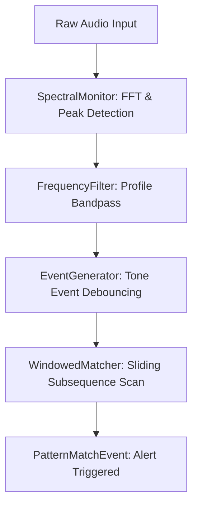

# Summary

In industrial, residential, and laboratory environments, device failures (e.g., server room temperature spikes, machine malfunctions, or hazard alarms) are often signaled by distinctive acoustic beeps or patterns. While these auditory cues are highly effective for nearby personnel, they are missed when facilities are unoccupied or remote. `Acoustic Engine` is a lightweight, low-resource Python library designed to run on resource-constrained edge hardware (e.g., single-board computers like Raspberry Pi) to monitor ambient audio and detect specific alarm patterns in real time.

Unlike resource-heavy machine learning approaches (e.g., convolutional neural networks running on GPUs), `Acoustic Engine` utilizes an optimized four-stage digital signal processing (DSP) pipeline: Input, Processing, Analysis, and Output. By combining fast Fourier transforms (FFT) with an adaptive, asymmetric noise-floor tracker and a sliding window pattern matcher, the engine achieves high sensitivity and noise immunity with minimal computational overhead (<5% CPU utilization on edge hardware).

# Statement of Need

Environmental monitoring and event logging systems typically fall into two categories: proprietary, device-specific IoT integrations (which are costly and often require replacing legacy equipment) or general-purpose deep-learning audio classification models. Machine-learning-based audio classifiers (such as YAMNet or custom CNNs) require substantial computational resources, making them expensive or impossible to deploy on cheap, low-power microcontrollers or single-board computers.

`Acoustic Engine` addresses this gap by providing an open-source, deterministic, and lightweight software package that turns any cheap microphone-connected single-board computer into an intelligent monitoring hub. Key innovations in `Acoustic Engine` include:
1. **Asymmetric Noise Floor Tracking:** A custom exponential moving average (EMA) filter that tracks ambient environmental noise dynamically, avoiding false positives during brief transient noises (e.g., slammed doors or dropped items).
2. **Frequency Filtering & Profile-Guided Resolution:** An engine optimization system that scans loaded alert profiles (defined in YAML) to determine the minimum required FFT chunk size and frequency window, ignoring out-of-band noise before it enters the matching pipeline.
3. **Windowed Subsequence Matcher:** A replacement for fragile state-machine matching. By buffering events in a rolling 60-second window and scanning for pattern subsequences, the engine successfully identifies cyclic alarm patterns even in the presence of dropped signals or intermediate noise.

# Architecture & Implementation

The architecture of `Acoustic Engine` is divided into four main stages:

1. **Input:** Captures raw int16 mono audio buffers from local hardware or synthetic generation.
2. **Processing (`SpectralMonitor` & `FrequencyFilter`):** Runs FFT on incoming audio chunks, applies parabolic interpolation to find precise spectral peaks, tracks the background noise floor using an asymmetric EMA, and discards peaks falling outside the targeted profiles' ranges.
3. **Analysis (`EventGenerator` & `WindowedMatcher`):** Evaluates peak persistence across time chunks to generate discrete `ToneEvent` structures, accounting for reverb tails and frequency jitter. A rolling window buffer matches sequences against programmed frequency and silence intervals.
4. **Output (`ParallelEngine`):** Dispatches events to downstream notification mechanisms (e.g., webhooks, logs, or external IoT triggers).

# References

- Welch, P. D. (1967). *The use of fast Fourier transform for the estimation of power spectra.* IEEE Transactions on Audio and Electroacoustics.
